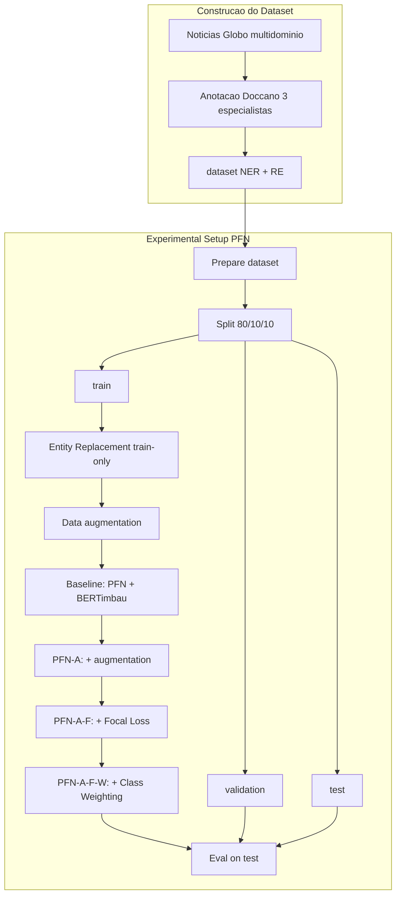

# NewsER: Um dataset de notícias em Português de múltiplos domínios para extração conjunta de NER e RE.

Este repositório contém o conjunto de dados e a implementação do código para avaliar a Extração Conjunta de Entidades e Relações em língua portuguesa. O dataset é composto por artigos de notícias de múltiplos domínios anotados para NER e RE.

Para validação, adaptamos a arquitetura original do **Partition Filter Network (PFN)** neste novo corpus.

## Workflow

Fluxo da construção do corpus NewsER e do setup experimental com PFN (fases incrementais Baseline → PFN-A → PFN-A-F → PFN-A-F-W).

Encoder: BERTimbau; Focal Loss (γ = 2.0); Class Weighting nas classes sub-representadas. Comparação em 30 epochs; melhor configuração (PFN-A-F-W) em 100 epochs. AdamW, learning rate \(2 \times 10^{-5}\), batch size 20, PFN hidden size 300, dropout e drop-connect 0.1.

---

## Visão Geral do Dataset

Nosso dataset foi construído a partir de artigos de notícias de diversos domínios (como esportes, política e entretenimento) do portal Globo. O processo de anotação foi realizado por 3 especialistas utilizando a plataforma Doccano, adotando uma abordagem de validação cruzada e resolução de divergências por consenso.

### Estatísticas Principais:

- **Documentos:** 194 artigos
- **Total de Entidades:** 12.521 distribuídas em 17 classes.
- **Total de Relações:** 1.813 relações semânticas distribuídas em 15 categorias

As divisões do dataset (treino, validação e teste) e o esquema de anotação estão disponíveis no diretório `data/`.
E a implementação está disponível no diretório `src/`
